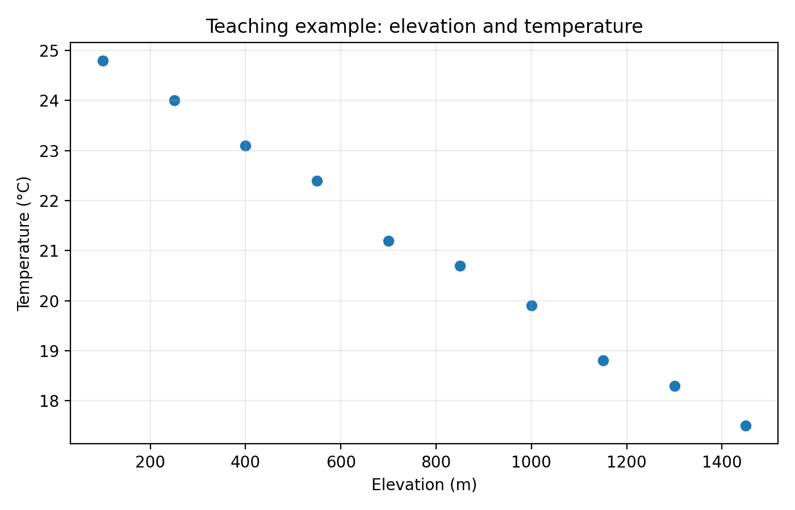
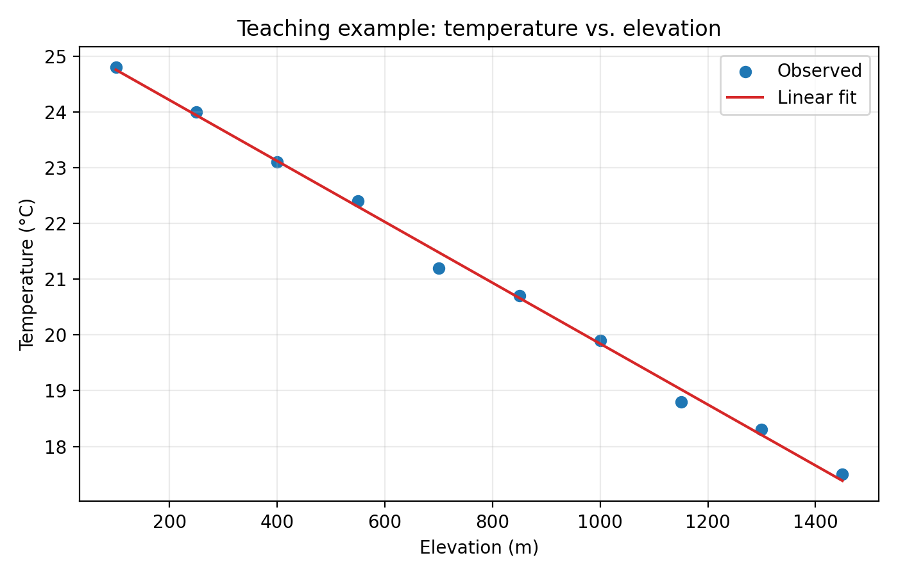
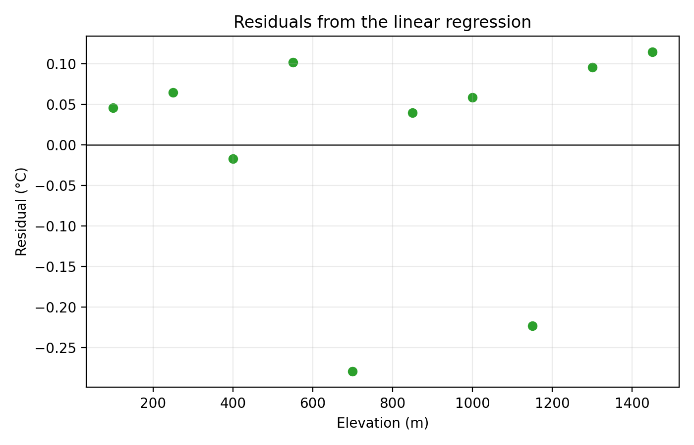

# 地学 AI 方法①：为什么山越高通常越冷？从线性回归开始

写给地学研究者的统计学习与 AI 方法通识课  
从最经典、也最容易被低估的方法开始

很多人一提到“AI 方法”，就会想到随机森林、神经网络、大模型，仿佛只有这些“新东西”才值得讨论。

但如果你真的做过地学研究，就会发现一个事实：

线性回归虽然不是严格意义上的“新式 AI 算法”，但它是统计学习和机器学习中最基础、最常用、也最有生命力的方法之一。

把它放在这个系列第一期，并不是为了把所有传统统计方法都包装成 AI，而是因为很多 GeoAI 模型都建立在同一套基本问题之上：变量关系、模型拟合、预测误差、参数解释和适用边界。

因为很多地学问题，本质上都可以归结为一句话：

```text
一个变量，是否会随着另一个变量变化？
```

比如：

- 地表温度会不会随着高程升高而降低？
- 湖泊面积是否会随着降水变化而变化？
- NDVI 是否会随着降水增加而升高？
- 土壤含水量是否与地形位置有关？
- 城市地表温度是否会随着不透水面比例增加而升高？

只要你在研究“变量关系”“影响因素”“预测趋势”或“驱动机制”，你大概率就在和回归分析打交道。

这一期，我们先不讲复杂模型，而是从最基础的一元线性回归开始，用一个地学研究者很熟悉的问题来入门：

```text
高程升高，温度是否会降低？
```

## 一、什么是线性回归？

先不用想得太复杂。

线性回归的核心目标，其实就是：

```text
用一条直线，描述一个变量如何随着另一个变量变化。
```

最简单的形式是：

```text
y = a + b x + error
```

其中：

- `y`：你关心的结果，比如地表温度。
- `x`：你认为会影响它的因素，比如高程。
- `a`：截距。
- `b`：回归系数，也就是这条线的斜率。
- `error`：模型没有解释掉的部分。

如果把它放到本期问题里，就是：

```text
温度 = 截距 + 斜率 × 高程 + 误差
```

如果斜率是负的，就说明在这组数据中，高程越高，模型预测的温度越低。

这就是线性回归最直观的意义。

## 二、为什么用“温度与高程”讲第一期？

因为它足够地学，也足够直观。

我们在山地、青藏高原、垂直自然带、冰川和冻土研究中，经常会遇到温度随高程变化的问题。气象学中也有 lapse rate 的概念，用来描述温度随高度变化的速率。

当然，真实温度变化并不只受高程影响。纬度、坡向、下垫面、季节、天气过程、观测时间都会产生影响。

但正因为如此，这个例子很适合讲线性回归：

- 它有明确的地学背景。
- 它有清楚的变量关系。
- 它能展示“模型有用，但不能过度解释”。

这也是我们学习后续机器学习和 AI 方法时最重要的训练之一：不要只看模型输出，还要知道模型在回答什么问题、没有回答什么问题。

## 三、先看散点图：变量之间有没有关系？

在做线性回归之前，第一步不是直接跑模型，而是先画图。

想象我们有一组教学数据，每个点代表一个观测地点：

- 横轴是高程。
- 纵轴是温度。

如果散点整体从左上往右下排列，就说明高程和温度可能存在负相关关系。



这张图的作用很简单：先让我们看到变量关系的大致方向。

在地学研究中，这一步很重要。因为模型不是替代观察，而是建立在观察之上。散点图可以帮助我们判断：

- 关系大致是正向还是负向？
- 点是否非常分散？
- 是否存在异常值？
- 是否可能不是线性关系？

如果连散点图都不看，直接进入模型，很容易把一个不合适的问题包装成看似严谨的结果。

## 四、拟合一条线：线性回归到底做了什么？

线性回归会在散点之间寻找一条“最合适”的直线。

这里的“最合适”不是指穿过所有点，而是让观测值和预测值之间的误差整体尽可能小。scikit-learn 的 `LinearRegression` 文档把它描述为 ordinary least squares linear regression，也就是普通最小二乘线性回归。

拟合后，我们会得到两个最基本的结果：

- 截距：当高程为 0 时，模型给出的温度基准值。
- 斜率：高程每增加一个单位，温度平均变化多少。



如果斜率为负，可以解释为：

```text
在这组样本中，高程越高，温度平均越低。
```

但注意，这句话必须加上“在这组样本中”。

线性回归描述的是统计关系，不是自动证明因果机制。我们不能因为斜率为负，就说“高程是温度变化的唯一原因”。真实地表温度还可能受到纬度、坡向、植被、水体、城市化和天气过程影响。

## 五、代码实操：一个最基础的线性回归示例

本期 GitHub 示例使用一组教学构造数据，字段包括：

- `elevation_m`：高程，单位为米。
- `temperature_c`：温度，单位为摄氏度。

数据是为了教学构造的，不代表真实观测，也不能用于估计某个区域的真实 lapse rate。

核心代码逻辑如下：

```python
from sklearn.linear_model import LinearRegression

X = data[["elevation_m"]]
y = data["temperature_c"]

model = LinearRegression()
model.fit(X, y)

pred = model.predict(X)
```

完整 notebook 已经放在 GitHub 的 `episodes/01-linear-regression/` 文件夹中。

## 六、残差图：模型没有解释掉什么？

线性回归不是只看一条拟合线。

还要看残差。

残差就是：

```text
残差 = 观测值 - 预测值
```

如果残差围绕 0 附近随机分布，说明这条直线大致捕捉了主要趋势。如果残差呈现弯曲、分组、扇形扩散或空间聚集，就说明模型可能遗漏了重要结构。



在地学研究中，残差尤其值得关注。

因为残差可能提示：

- 某些区域存在特殊地形或下垫面影响。
- 模型遗漏了纬度、坡向或土地覆盖变量。
- 变量关系并不是简单直线。
- 数据中存在异常观测或尺度不匹配。

这也是线性回归的一个重要价值：它不仅给你一个结果，还能帮你发现模型解释不了的地方。

## 七、线性回归能解决什么地学问题？

线性回归适合解决三类基础问题。

### 1. 描述关系

例如：

- 高程与温度的关系。
- 降水与 NDVI 的关系。
- 不透水面比例与地表温度的关系。

它可以把“看起来有关”变成一个可以量化的斜率。

### 2. 建立基线预测

线性回归可以作为更复杂模型之前的基线。

如果一个简单线性模型已经能解释大部分变化，那么复杂模型是否真的必要？如果复杂模型提升明显，它提升的是哪一部分？这些问题都需要一个清楚的基线来比较。

### 3. 帮助理解机制

线性回归不等于机制证明，但它可以帮助我们提出机制假设。

比如温度随高程下降，可能与垂直气温递减有关；但具体到某个区域，还需要结合地形、环流、地表覆盖和观测数据进一步分析。

## 八、什么时候不要轻易用线性回归？

线性回归简单，但不能滥用。

以下情况要特别谨慎：

- 关系明显不是直线。
- 样本范围太窄。
- 异常值对斜率影响很大。
- 残差有明显空间结构。
- 研究目标是因果解释，但数据设计只支持相关分析。

尤其是最后一点很重要。

线性回归可以告诉我们变量之间如何一起变化，但不能自动告诉我们为什么这样变化。地学研究要避免把“相关关系”写成“因果机制”。

## 九、小结

线性回归不是新式 AI 算法，但它是进入地学机器学习和 GeoAI 之前最应该先掌握的基础方法之一。

它让我们学会：

- 如何把地学问题写成变量关系。
- 如何用模型表达平均趋势。
- 如何解释斜率。
- 如何检查残差。
- 如何避免把相关关系说成因果关系。

从这一期开始，我们不是为了追逐复杂模型，而是先把地学数据建模的基本语言讲清楚。

下一期，我们继续沿着“回归”这条线往前走：当研究对象不再是一个连续数值，而是“是否发生某类地学事件”时，模型应该怎么处理？我们将用滑坡易发性作为例子，介绍 Logistic 回归。

## 本期代码与图件

本期的完整 GitHub 版本、可运行 notebook、示例数据说明、参考资料和图件已经整理到项目仓库：

```text
https://github.com/ali820/LearnGeoAI
```

对应目录：

```text
episodes/01-linear-regression/
```

如果你想跟着连载复现代码、修改示例、下载图件，或者后续系统学习地学 AI 方法，可以收藏或 fork 这个仓库。后续每一期都会尽量同步保留公众号版、GitHub 长文版、notebook、图件和参考资料。
