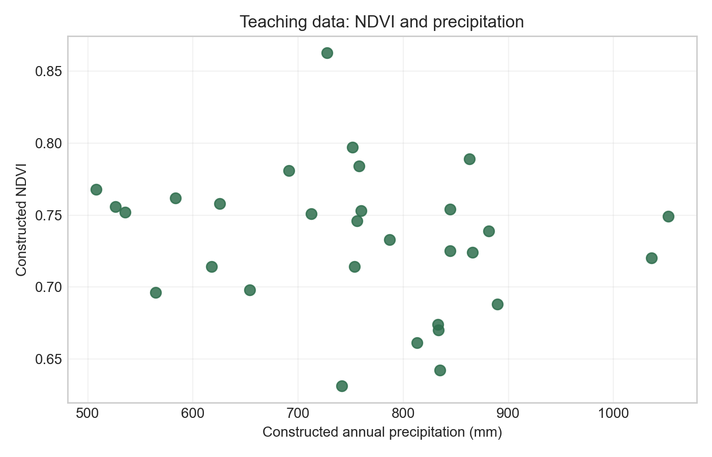
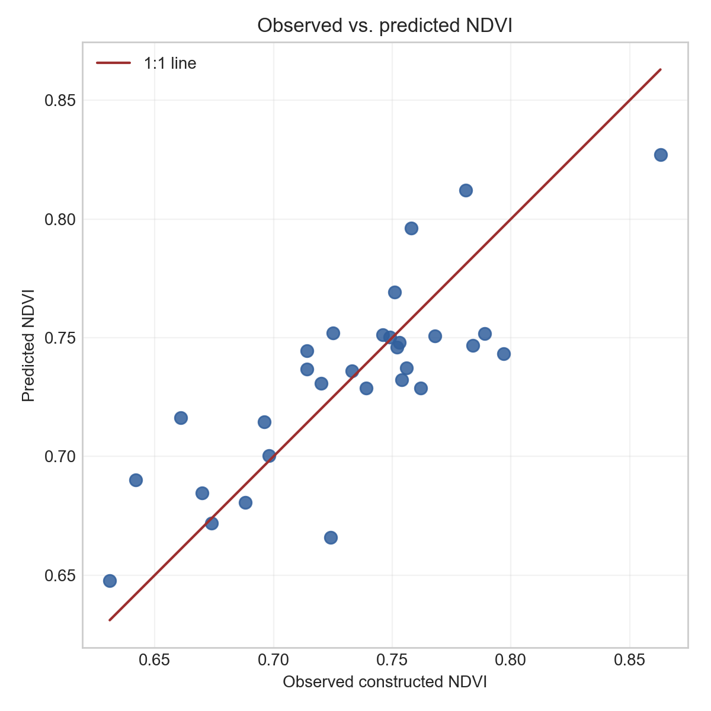
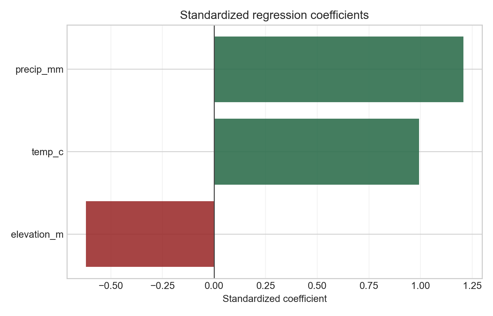
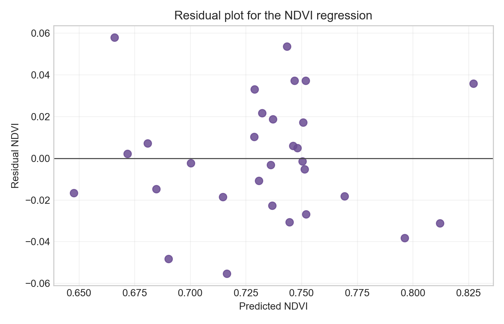
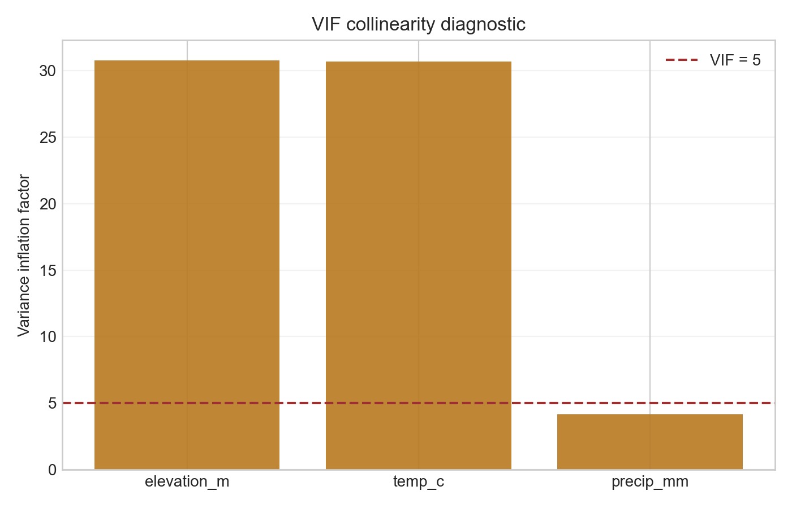

# 地学人工智能算法①：回归分析到底能解决什么问题？写给地学研究者的 AI 方法通识课

## 先从一个很常见的问题说起

做地学研究时，我们经常会遇到这样的句子：

降水越多，植被是不是越好？

气温升高后，冰川退缩会不会更明显？

坡度、岩性、降雨强度一起变化时，哪里更容易发生滑坡？

这些问题听起来不一定像“人工智能”。但如果把它们拆开，会发现它们都有一个共同点：我们想知道一个地学变量，能不能被另一些变量解释、预测或分类。

这正是回归分析最擅长处理的事情。

所以这个系列不从深度学习开始，也不先讲复杂模型。第一期先讲回归。因为回归是很多地学 AI 方法的底层语言：它让我们理解变量关系、模型参数、预测误差和方法边界。没有这些概念，后面讲随机森林、支持向量机、神经网络，也很容易只停留在“调包跑模型”。

## 回归到底是什么

一句话说，回归是在回答：

```text
一个目标变量，如何随着一个或多个解释变量变化？
```

目标变量可以是连续数值，例如 NDVI、地表温度、土壤含水量、径流量、污染物浓度。

解释变量可以是气候、地形、土壤、土地覆盖、人类活动强度，也可以是遥感影像提取出来的指数和纹理特征。

最简单的形式是：

```text
Y = a + bX + 误差
```

这里的 `Y` 是我们想解释或预测的变量，`X` 是可能影响它的变量，`b` 表示平均关系的方向和强度，误差表示模型没有解释掉的部分。

这句话看起来朴素，但很重要。地学问题从来不是“所有点都严格落在一条线上”。地表系统有噪声、有尺度差异、有观测误差，也有大量未被纳入模型的过程。回归的价值，不是把复杂世界说成一条直线，而是先建立一个可解释、可检查、可比较的基准模型。

## 为什么第一期要从回归开始

因为回归教会我们三件事。

第一，模型不是黑箱之前，先是问题表达。

当我们写出 `NDVI = 降水 + 气温 + 高程 + 误差`，其实已经在明确研究问题：我们关心的是植被状态与气候、地形条件之间的统计关系。

第二，预测必须和解释分开看。

一个模型预测得不错，不代表它解释了机制；一个变量系数显著，也不代表它就是直接原因。回归迫使我们区分相关、解释、预测和因果，这对地学研究尤其关键。

第三，模型结果要被诊断。

系数、拟合优度、残差、共线性、异常点，这些不是附属信息，而是判断模型是否可信的基本证据。后续更复杂的 AI 模型，也同样需要这些诊断意识。

## 一元回归：先看两个变量怎么一起变

一元回归只考虑一个解释变量。

例如：

```text
NDVI = a + b × 降水 + 误差
```

这个模型可以回答一个直接问题：在这组样本中，降水较高的地方，NDVI 是否也倾向于更高？

如果散点图大致向上，说明二者存在正向关联。如果点很分散，说明降水可能只是影响 NDVI 的因素之一。如果关系明显弯曲，说明一条直线可能太简单。



在地学里，一元回归常用于建立第一层直觉。比如：

- 用高程解释气温变化。
- 用降水解释植被指数变化。
- 用不透水面比例解释地表温度变化。
- 用坡度解释侵蚀强度变化。

它的优点是清楚，缺点也清楚：真实地表过程通常不只受一个变量控制。

## 多元回归：把多个地学因素放到同一个模型里

多元回归把多个解释变量同时放进模型：

```text
NDVI = a + b1 × 降水 + b2 × 气温 + b3 × 高程 + 误差
```

这比一元回归更接近地学问题的实际结构。

例如，在一个区域里，NDVI 可能与降水有关，也可能与气温有关，还可能受到高程控制。高程本身又会影响温度、水分条件和土地利用方式。如果只看降水和 NDVI 的关系，我们可能会把高程或温度带来的差异误认为降水效应。

多元回归的作用，是在同一个统计框架里同时比较多个变量。它可以帮助我们判断：在其他变量也被纳入模型之后，某个变量是否仍然与目标变量存在稳定关系。

本期 GitHub 示例使用的是教学构造数据，不代表任何真实区域的观测结果。我们用它演示一个典型流程：

```text
NDVI = Precip + Temp + Elevation
```

也就是用降水、气温和高程共同解释 NDVI 的空间差异。

模型拟合后，可以画出观测值和预测值的对比图。这个图不证明模型“正确”，但能帮助我们判断预测结果是否大致贴近观测值，以及是否存在系统性偏差。



为了比较不同变量的重要性，示例中还会展示标准化系数。标准化之后，不同单位的变量可以放到同一尺度上比较方向和相对大小。



这里仍然要注意：标准化系数不是机制强度的最终证据。它只是在当前模型、当前变量集合和当前样本范围内，对统计关联大小的一种表达。

## 非线性回归：当地学关系不是一条直线

很多地学关系并不线性。

降水增加到一定程度后，NDVI 可能不再明显增加。温度对植被的影响可能存在适宜范围，过低或过高都不利于生长。坡度对侵蚀的影响也可能在某些区间更敏感。

这时，非线性回归可以用来表达弯曲关系。例如加入二次项：

```text
NDVI = a + b1 × 降水 + b2 × 降水² + 误差
```

或者使用对数、指数、分段函数等形式。

非线性回归能解决的问题不是“让模型看起来更高级”，而是让模型形式更接近研究对象的变化规律。前提是这种弯曲关系有明确的经验依据、图形证据或理论理由，而不是为了提高拟合度随意添加复杂项。

## 逻辑回归：当问题变成“是否发生”

逻辑回归名字里有“回归”，但它处理的不是连续数值，而是二分类或概率问题。

例如：

```text
是否发生滑坡 = f(坡度, 降雨, 岩性, 距道路距离)
```

输出可以理解为某个事件发生的概率。地学中常见的应用包括：

- 是否发生滑坡。
- 某个像元是否为水体。
- 某个区域是否属于高风险区。
- 某个样点是否出现土壤污染超标。

逻辑回归适合做二分类问题的基准模型。它的结果相对可解释，可以检查每个变量与事件发生概率之间的关系。但它同样不自动提供因果解释，也不能替代严谨的采样设计和验证数据。

## 为什么地学特别需要回归

地学数据有几个特点，使回归分析特别有用。

第一，变量多，而且彼此纠缠。

气候、地形、土壤、水文、植被和人类活动往往同时作用。回归提供了一种把多个变量放在同一张表里进行比较的方法。

第二，空间异质性强。

同样的降水量，在平原、山地、城市和荒漠中的意义可能不同。回归可以先建立整体关系，再通过残差和分区分析发现模型解释不了的空间结构。

第三，很多研究需要一个可解释基准。

在使用复杂 AI 模型之前，先建立一个回归模型，可以帮助我们回答：简单模型已经能解释多少？哪些变量方向符合预期？误差主要出现在什么地方？复杂模型是否真的带来了额外价值？

第四，地学结论经常需要面向管理和决策。

相比只给出一个预测栅格，回归还能提供变量方向、效应大小、误差诊断和不确定性讨论的入口。这些信息更容易被写进论文、报告和政策沟通中。

## 本期 GitHub 代码和图件会做什么

本期代码会放在 GitHub 仓库的 `episodes/01-linear-regression/` 文件夹中。

需要强调：示例数据是教学构造数据，只用于演示建模流程、图件制作和结果解释方式。它不对应真实研究区，也不能被解读为真实的 NDVI、降水、气温或高程关系。

代码会包含以下步骤：

1. 构造一份包含 `NDVI`、`Precip`、`Temp`、`Elevation` 的教学数据。
2. 绘制降水与 NDVI 的散点图。
3. 拟合多元线性回归模型。
4. 输出观测值与预测值对比图。
5. 绘制标准化系数图。
6. 检查残差图。
7. 检查变量之间的共线性，并绘制 VIF 图。

残差图用于判断模型误差是否随机分布。如果残差呈现弯曲、扇形扩散或其他结构，说明模型可能遗漏了非线性关系、异方差或关键变量。



VIF 图用于检查解释变量之间是否存在较强共线性。共线性不会一定破坏预测，但会影响系数解释：当解释变量彼此高度相关时，很难稳定判断单个变量的独立贡献。



## 方法边界：回归能做什么，不能做什么

回归可以帮助我们描述关系、建立预测、比较变量、发现异常和构建基准模型。

但它不能自动完成以下事情。

第一，不能把相关关系直接变成因果关系。

如果一个区域中高程越高 NDVI 越低，这可能与温度、水分、土壤、土地利用或观测季节有关。普通回归只能描述在当前数据中的统计关系，不能单独证明高程导致 NDVI 变化。

第二，不能替代研究设计。

样本怎么来、时间范围是什么、变量单位是否一致、遥感产品如何预处理、空间分辨率是否匹配，这些都会影响模型结果。模型再规整，也无法弥补数据设计中的根本问题。

第三，不能忽略空间结构。

地学数据常常存在空间自相关。相邻像元或样点往往并不独立。如果残差在空间上聚集，普通回归的假设可能不再充分，需要进一步考虑空间回归、分区建模或其他方法。

第四，不能无限外推。

如果模型只在某个气候区、某个季节或某个高程范围内训练，就不应轻易推广到完全不同的区域和时间。回归模型的解释和预测都应限定在数据支持的范围内。

## 小结

回归分析不是地学 AI 中最复杂的方法，但它是最应该先掌握的方法之一。

它让我们把问题写清楚：目标变量是什么，解释变量是什么，关系方向是什么，误差在哪里，模型边界在哪里。

对地学研究者来说，回归不是过时工具，而是一种基本训练。它帮助我们在进入更复杂模型之前，先学会用数据谨慎地表达判断。

下一期可以继续讲逻辑回归：当地学问题从“数值是多少”变成“事件是否发生”时，模型会怎样改变。
