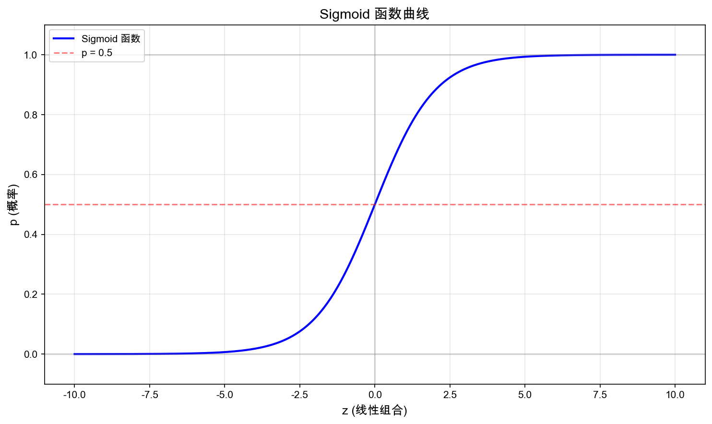
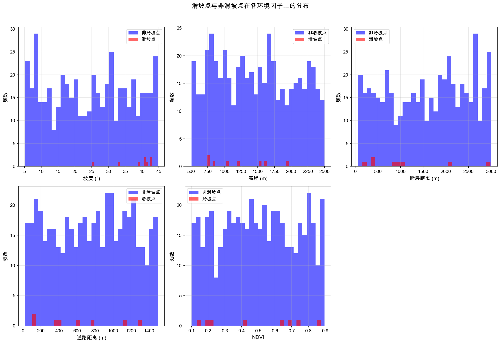
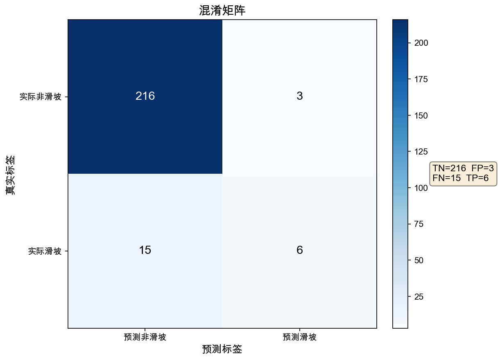
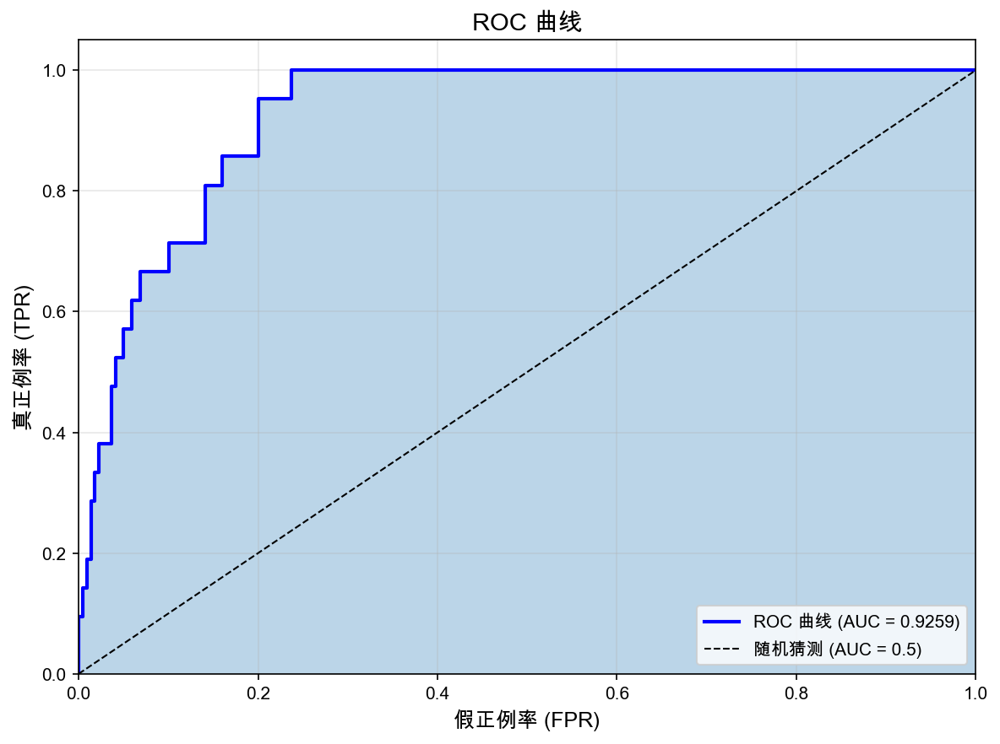
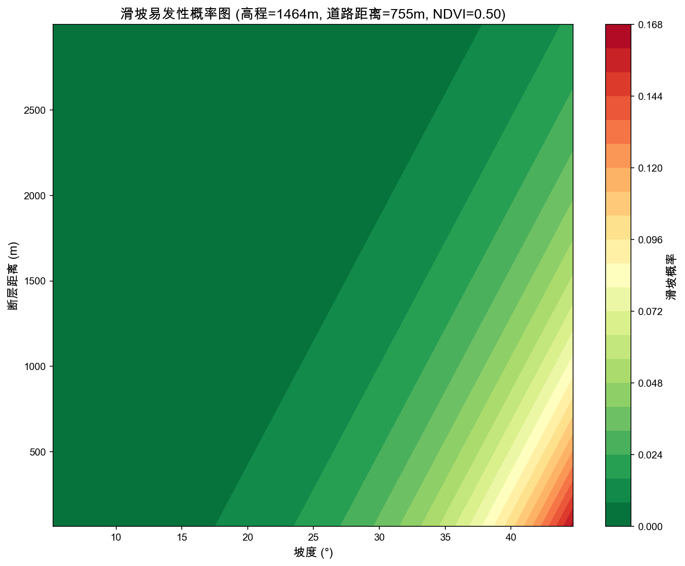

# 第 02 期：Logistic 回归与滑坡易发性

## 本期问题

滑坡是山区常见的地质灾害之一，对人民生命财产安全构成严重威胁。滑坡易发性评价是地质灾害风险管理的核心内容，其目标是估计区域内各位置发生滑坡的相对可能性。

在实际工作中，我们经常面临这样的问题：

```text
给定一组环境变量（如坡度、岩性、断层距离、道路距离、植被覆盖等），
如何判断某个位置是否可能发生滑坡？
```

这是一个典型的二分类问题：每个位置要么"发生过滑坡"，要么"未发生滑坡"。线性回归不适合这类问题，因为它输出的是连续值，而我们需要的是概率或类别判断。Logistic 回归正是解决这类问题的经典方法。

本期用滑坡易发性评价作为案例，讲解 Logistic 回归的基本原理、实现方法和地学解释。

## 算法直觉

### 从线性回归到 Logistic 回归

上一期我们学习了线性回归，它用一条直线拟合连续变量之间的关系：

```text
y = a + b₁x₁ + b₂x₂ + ... + error
```

当目标变量是二分类（是/否、发生/未发生）时，线性回归会遇到几个问题：

1. **预测值超出 [0, 1] 范围**：线性回归可能输出负值或大于 1 的值，无法解释为概率。
2. **误差分布不合理**：二分类变量的误差不服从正态分布。
3. **异方差问题**：不同预测值对应的误差方差不同。

Logistic 回归通过一个简单的变换解决了这些问题：把线性组合的结果映射到 [0, 1] 区间。

### Sigmoid 函数

Logistic 回归的核心是 Sigmoid 函数：

```text
p = 1 / (1 + e^(-z))
```

其中 `z = a + b₁x₁ + b₂x₂ + ...` 是线性组合。

Sigmoid 函数的特点：

- 当 z → +∞ 时，p → 1
- 当 z → -∞ 时，p → 0
- 当 z = 0 时，p = 0.5
- 输出值始终在 (0, 1) 区间

这意味着我们可以把线性组合的结果解释为"发生某事件的概率"。

### 决策边界

在二分类问题中，我们需要一个阈值来决定预测类别。最常用的阈值是 0.5：

- 如果 p ≥ 0.5，预测为正类（如"可能滑坡"）
- 如果 p < 0.5，预测为负类（如"不易滑坡"）

但在实际应用中，阈值的选择需要根据具体问题权衡。例如，在滑坡预警中，我们可能选择更低的阈值以减少漏报风险。

## 核心公式

### Logistic 回归模型

```text
p(y=1|x) = 1 / (1 + e^(-(a + b₁x₁ + b₂x₂ + ... + bₙxₙ)))
```

其中：

- `p(y=1|x)`：给定特征 x 时，事件发生的概率
- `a`：截距
- `b₁, b₂, ..., bₙ`：各特征的回归系数
- `x₁, x₂, ..., xₙ`：特征变量

### 对数几率（Logit）形式

对上述公式变形，可以得到：

```text
ln(p/(1-p)) = a + b₁x₁ + b₂x₂ + ... + bₙxₙ
```

左边称为对数几率（log-odds），右边是线性组合。这解释了"Logistic 回归"名称的由来：它是对数几率的线性回归。

### 系数解释

在 Logistic 回归中，系数 bᵢ 的含义是：

```text
当其他变量保持不变时，xᵢ 每增加一个单位，对数几率增加 bᵢ
```

更直观的解释是几率比（Odds Ratio）：

```text
OR = e^bᵢ
```

如果 bᵢ > 0（OR > 1），说明 xᵢ 增加会提高事件发生概率；如果 bᵢ < 0（OR < 1），则相反。

### 损失函数

Logistic 回归使用极大似然估计，等价于最小化交叉熵损失：

```text
L = -Σ[yᵢlog(pᵢ) + (1-yᵢ)log(1-pᵢ)]
```

这个损失函数惩罚错误的概率预测：当真实标签为 1 时，预测概率 p 越小损失越大；当真实标签为 0 时，预测概率 p 越大损失越大。

## 图解流程

本期工作流如下：

```text
滑坡编目数据 + 环境因子图层
            ↓
    样本点提取与数据准备
            ↓
    数据标准化与训练集划分
            ↓
    Logistic 回归模型训练
            ↓
    系数解释与概率预测
            ↓
    分类性能评估（混淆矩阵、ROC曲线）
            ↓
    易发性图制作
```

### 图 1：Sigmoid 函数曲线



Sigmoid 函数将任意实数映射到 (0, 1) 区间，是 Logistic 回归的核心变换。

### 图 2：滑坡点与环境因子散点图



观察滑坡点与非滑坡点在各环境因子上的分布差异，帮助理解哪些因子可能与滑坡发生相关。

### 图 3：混淆矩阵



混淆矩阵展示模型的分类效果：真正例（TP）、假正例（FP）、假负例（FN）、真负例（TN）。

### 图 4：ROC 曲线与 AUC



ROC 曲线展示不同阈值下的真正例率（TPR）和假正例率（FPR）。AUC（曲线下面积）衡量模型整体区分能力。

### 图 5：滑坡易发性图



将训练好的模型应用于整个研究区域，生成滑坡易发性概率图。高概率区域表示更高的滑坡风险。

## Python 示例

进入本期目录后运行：

```bash
jupyter notebook notebook.ipynb
```

Notebook 包含以下步骤：

1. 构造滑坡易发性教学数据（包含坡度、高程、断层距离、道路距离等因子）。
2. 数据探索与可视化。
3. 使用 `scikit-learn` 的 `LogisticRegression` 训练模型。
4. 输出系数、几率比和模型性能指标。
5. 绘制混淆矩阵和 ROC 曲线。
6. 生成滑坡易发性概率图。

示例数据仅用于解释算法，不代表真实滑坡编目数据。后续如果替换为真实数据，需要在 `data/README.md` 中记录数据来源、许可证、下载日期、字段说明和预处理方法。

## 地学解释

### 系数的物理意义

在滑坡易发性建模中，Logistic 回归的系数可以解释为各环境因子对滑坡发生的影响方向和强度：

| 因子 | 预期符号 | 地学解释 |
| --- | --- | --- |
| 坡度 | 正 (+) | 坡度越大，重力势能释放越容易，滑坡风险增加 |
| 高程 | 不确定 | 取决于区域地形特征和气候条件 |
| 断层距离 | 负 (-) | 距断层越近，岩体破碎程度越高，滑坡风险增加 |
| 道路距离 | 负 (-) | 距道路越近，人工扰动越大，滑坡风险增加 |
| 植被覆盖 | 负 (-) | 植被根系固土，NDVI 越高滑坡风险越低 |
| 降雨量 | 正 (+) | 降雨增加孔隙水压力，降低土体稳定性 |

### 概率的空间解释

模型输出的概率 p 表示"在给定环境条件下发生滑坡的可能性"。这个概率可以用于：

1. **易发性分区**：将概率划分为高、中、低易发区。
2. **风险预警**：结合降雨预报，动态评估滑坡风险。
3. **规划决策**：指导土地利用规划和工程建设选址。

### 模型局限

Logistic 回归假设各因子与对数几率之间是线性关系，这可能无法捕捉复杂的非线性效应和因子交互作用。此外：

- 样本代表性：滑坡编目数据可能存在空间偏差。
- 因子选择：遗漏重要因子会影响模型效果。
- 时间动态：静态模型难以捕捉时间变化过程。

## 适用边界

Logistic 回归适合：

- 目标变量是二分类变量。
- 需要输出概率估计。
- 研究目标是理解因子影响方向和强度。
- 样本量适中，特征数量不过多。
- 需要可解释的模型。

需要谨慎的情况包括：

- 因子与对数几率之间存在明显非线性关系。
- 因子之间存在高度共线性。
- 样本严重不平衡（如滑坡点远少于非滑坡点）。
- 需要捕捉复杂的因子交互作用。
- 研究问题需要因果推断，但数据设计只支持相关分析。

对于更复杂的场景，可以考虑决策树、随机森林、梯度提升树等方法，但 Logistic 回归仍然是理解分类问题的重要起点。

## 延伸阅读

本期参考资料记录在 `references.md`。建议重点查看以下内容：

1. scikit-learn 对 `LogisticRegression` 的官方文档。
2. 滑坡易发性评价的相关文献和方法指南。
3. ROC 曲线和 AUC 的统计学解释。
4. 样本不平衡问题的处理方法（如过采样、欠采样、类别权重）。
