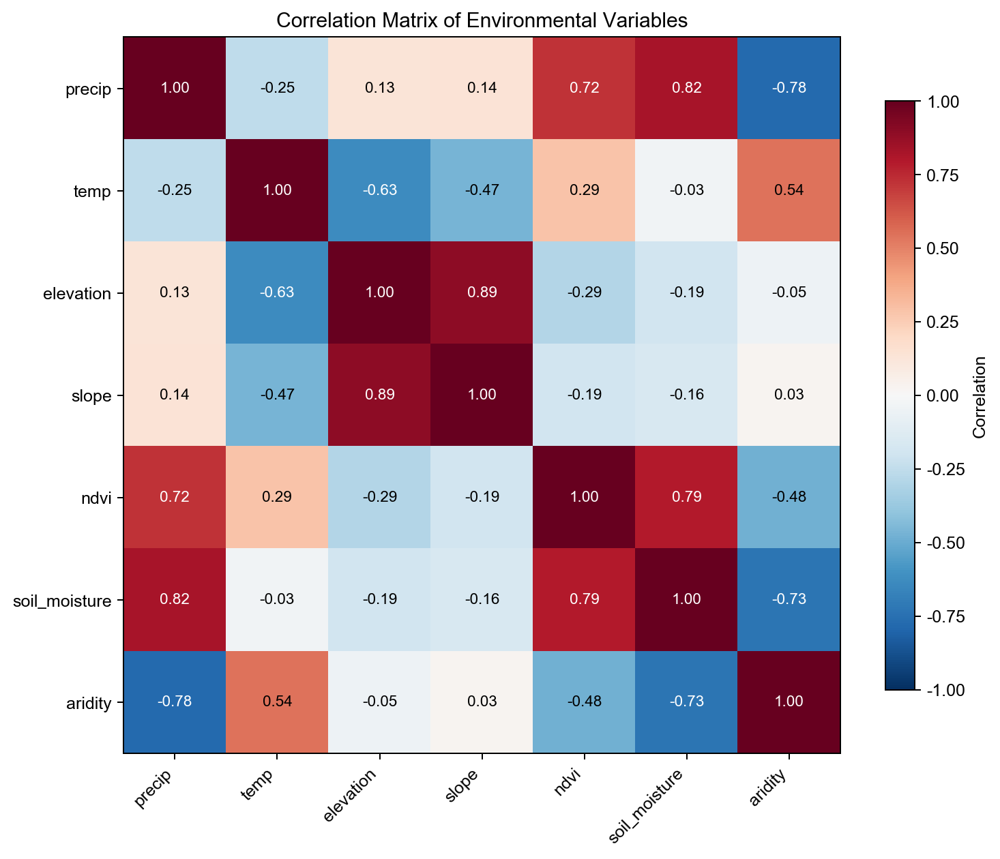
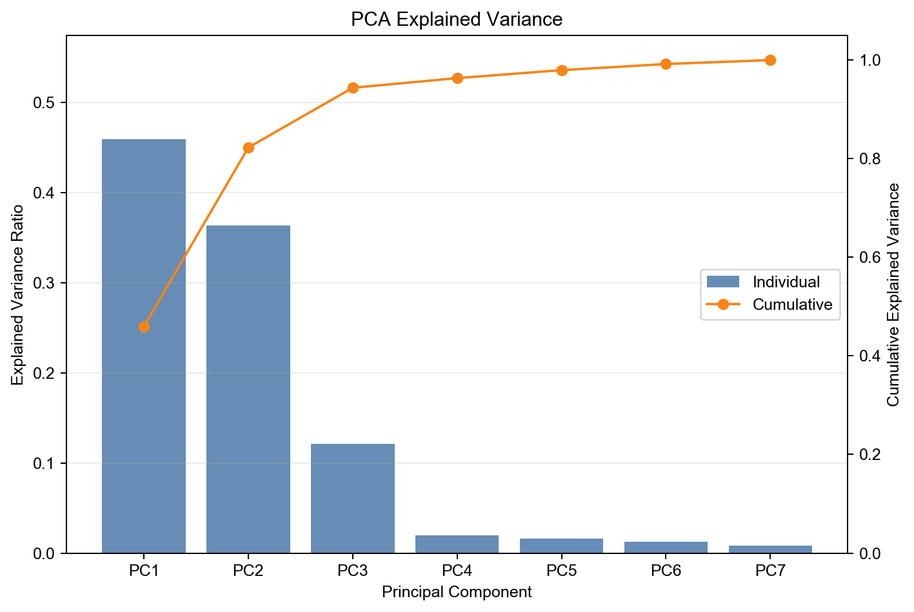
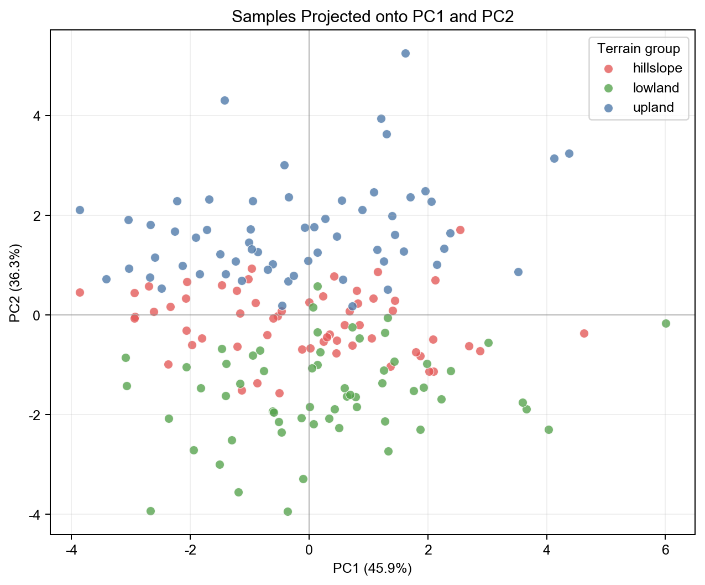
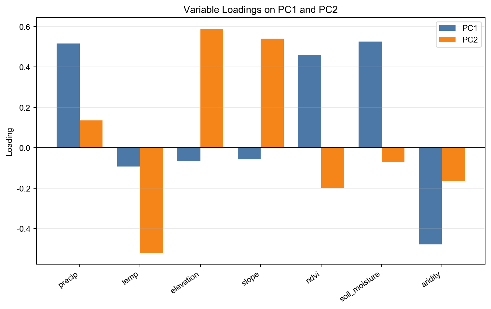
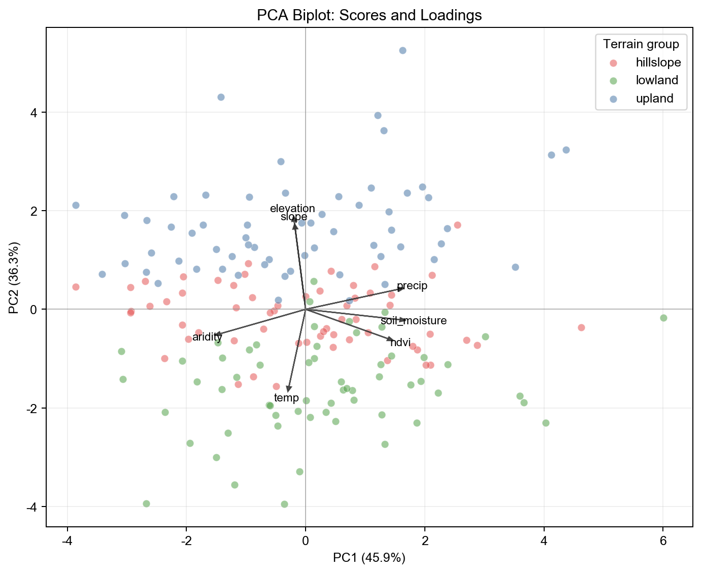

# 地学 AI 方法③：变量太多怎么办？从 PCA 理解降维

写给地学研究者的统计学习与 AI 方法通识课  
从多源环境变量开始，理解主成分分析为什么常被用来“压缩信息”

前两期，我们分别讲了线性回归和 Logistic 回归。

线性回归回答的是：

```text
一个连续变量，会不会随着另一些变量变化？
```

Logistic 回归回答的是：

```text
某个事件，会不会发生？
```

这一期，我们换一个地学研究中非常常见、但经常被低估的问题：

```text
变量太多，而且变量之间还彼此相关，怎么办？
```

比如你研究一个区域的植被、生态环境或灾害易发性，手头可能有很多环境变量：

- 年降水量
- 年均温
- 高程
- 坡度
- NDVI
- 土壤湿度
- 蒸散发
- 干旱指数
- 土地覆盖类型
- 距河流、距道路、距断层距离

变量一多，问题就来了。

有些变量表达的是相近信息。降水、土壤湿度和 NDVI 可能都与水分条件有关；高程、温度和坡度可能共同反映地形与气候梯度。把这些变量全部塞进模型里，不一定会让结果更好，反而可能带来冗余、共线性和解释困难。

这时，主成分分析（Principal Component Analysis, PCA）就很有用。

需要先说清楚：PCA 不是一个“新潮 AI 算法”，也不是专门为地学发明的方法。它是一种经典的多变量统计方法，在机器学习中常作为无监督降维和特征提取工具使用。它的价值不在于“看起来高级”，而在于能帮助我们把一组相关变量压缩成少数几个综合变量。

## 一、为什么变量太多会成为问题？

在地学研究里，“变量多”常常看起来是一件好事。

变量越多，似乎信息越充分；数据源越多，似乎模型越全面。

但实际建模时，变量过多至少会带来四类问题。

### 1. 信息冗余

很多环境变量并不是彼此独立的。

例如，在一个山地流域中，高程升高，温度往往下降；降水、土壤湿度和 NDVI 可能共同反映水分梯度；坡度和地形起伏度可能都在描述地形破碎程度。

这些变量当然不完全一样，但它们之间可能有相当一部分信息是重叠的。

如果不处理冗余，后续分析很容易变成：

```text
看似用了很多变量，实际反复表达同一类地学信息。
```

### 2. 共线性影响解释

在线性回归、Logistic 回归等模型中，自变量之间高度相关会让系数变得不稳定。

一个变量的系数可能因为另一个相关变量加入模型而改变方向或显著性。此时，直接比较“哪个变量更重要”就会变得很危险。

PCA 不能替代地学机制分析，但它能帮助我们先看清楚：

```text
这些变量背后，是否存在少数几个共同变化方向？
```

### 3. 可视化困难

二维图很好画，三维图还能勉强看。

但如果有 10 个、20 个甚至更多变量，我们很难直接观察样本之间的整体差异。PCA 可以把高维变量压缩到 PC1、PC2 这样的低维空间中，让样本分布、分组差异和异常点更容易被观察。

### 4. 噪声和维度负担

变量越多，不代表有效信息越多。

有些变量可能噪声较大，有些变量可能与研究问题关系很弱。对于样本量有限的地学研究，过多变量还可能增加模型不稳定性。

所以，变量多的时候，我们需要的不只是“再加模型”，还需要先问：

```text
这些变量能不能被少数几个综合维度概括？
```

这正是 PCA 想解决的问题。

## 二、PCA 到底在做什么？

PCA 的核心思想可以用一句话概括：

```text
在尽量保留原始数据主要变异信息的前提下，
把一组相关变量转换成少数几个互不相关的综合变量。
```

这些综合变量就叫**主成分**。

第一个主成分（PC1）解释原始数据中最多的方差信息；第二个主成分（PC2）解释剩余方差中尽可能多的信息，并且与 PC1 正交；后面的主成分依次类推。

换句话说，PCA 做的不是简单删变量，而是重新构造一组新的坐标轴。

原来我们用：

```text
降水、温度、高程、坡度、NDVI、土壤湿度……
```

描述每个样本。

经过 PCA 后，我们可能用：

```text
PC1、PC2、PC3……
```

描述每个样本。

如果前两个或前三个主成分已经保留了大部分信息，就说明原始变量中确实存在较强的共同变化结构。



图1 原始环境变量相关性热力图。演示数据中，降水、土壤湿度、NDVI 等变量存在较明显的相关关系，说明变量之间有部分信息重叠。

## 三、一个重要提醒：主成分不是“地学因子”

这是使用 PCA 时最容易出错的地方。

主成分是数学上构造出来的新变量，不是原始观测变量，也不一定直接对应某个明确的地学过程。

例如，PC1 可能同时包含降水、土壤湿度、NDVI 的正向贡献，也包含干旱指数的反向贡献。我们可以把它解释为“水分条件综合梯度”，但这是一种基于变量载荷和地学知识的解释，而不是 PCA 自动告诉我们的因果机制。

因此，写论文或报告时要避免这种表述：

```text
PCA 直接发现水分是植被变化的主控因子。
```

更稳妥的说法是：

```text
PCA 结果显示，降水、土壤湿度和 NDVI 在第一主成分上具有较高载荷，
说明样本间的主要差异与水分相关变量的共同变化有关。
```

前者把统计结构直接写成机制结论，过度了。

后者区分了观察结果、解释和机制推断，更严谨。

## 四、PCA 的基本计算思路

不用一开始就陷进矩阵推导。

对地学应用来说，理解 PCA 可以抓住四步：

### 第一步：标准化变量

不同变量的量纲差异很大。

例如：

- 高程可能是几百到几千米
- NDVI 通常在 -1 到 1 之间
- 降水量可能是几百毫米
- 坡度可能是几十度

如果不标准化，数值范围大的变量会在 PCA 中占据过大权重。

所以，在常见应用中，通常先把变量转成均值为 0、标准差为 1 的形式。

如果这些变量来自不同栅格或不同数据源，还要先完成更基础的地学数据处理：统一投影、空间分辨率、范围、掩膜和时间窗口。否则，PCA 看到的可能不是环境梯度，而是数据对齐误差。

### 第二步：寻找最大方差方向

PCA 会寻找一个方向，使样本投影到这个方向后方差最大。

这个方向就是 PC1。

它可以理解为：

```text
最能拉开样本差异的综合轴。
```

### 第三步：继续寻找新的正交方向

PC2 会与 PC1 正交，并尽可能解释剩余方差信息。

PC3、PC4 依次类推。

### 第四步：选择保留多少主成分

通常会看解释方差比例和累计解释方差。



图2 PCA 解释方差比例。柱状图表示每个主成分单独解释的方差比例，折线表示累计解释方差比例。保留多少主成分不能只看一个固定阈值，还要结合研究目的和后续模型需求。

## 五、代码实操：多源环境变量降维

下面用一个教学构造数据说明 PCA 的完整流程。

假设我们有一批样本点，每个样本包含 7 个环境变量：

- `precip`：年降水量
- `temp`：年均温
- `elevation`：高程
- `slope`：坡度
- `ndvi`：植被指数
- `soil_moisture`：土壤湿度
- `aridity`：干旱指数

这些变量不是完全独立的。我们希望通过 PCA 看看，能否用少数几个主成分概括它们的共同变化。

核心代码如下：

```python
import pandas as pd
from sklearn.preprocessing import StandardScaler
from sklearn.decomposition import PCA

data = pd.read_csv("data/environment_pca_demo.csv")

features = [
    "precip",
    "temp",
    "elevation",
    "slope",
    "ndvi",
    "soil_moisture",
    "aridity",
]

X = data[features]

scaler = StandardScaler()
X_std = scaler.fit_transform(X)

pca = PCA()
scores = pca.fit_transform(X_std)

explained = pca.explained_variance_ratio_
loadings = pd.DataFrame(
    pca.components_.T,
    index=features,
    columns=[f"PC{i+1}" for i in range(len(features))]
)

print(explained)
print(loadings[["PC1", "PC2"]])
```

完整 notebook、示例数据和图件已经放在 GitHub 的 `episodes/03-pca/` 目录。

## 六、怎么读 PC1 和 PC2？

PCA 输出后，最常看的两类结果是：

1. 主成分得分（scores）
2. 主成分载荷（loadings）

### 主成分得分：样本在新坐标轴上的位置

每个样本都会得到一个 PC1 得分、PC2 得分、PC3 得分……

如果把 PC1 和 PC2 画成散点图，就可以观察样本在低维空间中的分布。



图3 PC1-PC2 样本散点图。每个点代表一个样本，颜色表示演示数据中的地形分组。PCA 本身没有使用分组标签；颜色只是为了帮助观察低维空间中的样本结构。

如果某些样本在 PC1 方向上明显分开，说明它们在 PC1 所代表的综合变量组合上差异较大。

### 主成分载荷：原始变量对主成分的贡献方向

载荷可以帮助我们理解每个主成分主要由哪些变量构成。



图4 PC1 和 PC2 的变量载荷。载荷绝对值越大，说明该变量与对应主成分的关系越强；正负号表示方向，但主成分整体符号可以翻转，因此解释时应关注变量之间的相对方向。

例如，如果 PC1 上降水、NDVI、土壤湿度为正，而干旱指数为负，可以把 PC1 解释为与水分条件相关的综合梯度。

但要注意，这仍然是解释，不是自动证明。

## 七、PCA 双标图怎么看？

很多论文或报告会画 PCA biplot，也就是把样本得分和变量方向放在同一张图里。



图5 PCA 双标图示意。点表示样本在 PC1-PC2 空间中的位置，箭头表示原始变量在这两个主成分上的载荷方向。箭头方向相近，通常说明变量在该二维空间中具有相似变化方向。

双标图很直观，但也容易误读。

需要注意三点：

1. 图中只展示了 PC1 和 PC2，不能代表全部维度信息。
2. 箭头夹角反映的是低维投影下的关系，不等于完整相关结构。
3. 样本分组差异如果出现在图上，也只是探索性证据，不能直接写成因果结论。

## 八、PCA 在地学里适合做什么？

PCA 在地学中的典型用途包括：

### 1. 多源环境变量降维

当变量数量较多且相关性明显时，可以用 PCA 把原始变量压缩成少数几个主成分，作为后续聚类、回归或分类模型的输入。

例如：

```text
降水 + 土壤湿度 + NDVI + 干旱指数
```

可能共同形成一个水分条件相关主成分。

### 2. 探索样本结构

PCA 可以帮助观察样本是否存在分组、梯度或异常点。

例如，不同生态区、不同地貌区、不同土地覆盖类型的样本，是否在 PC1-PC2 空间中表现出差异。

### 3. 降低共线性

由于主成分彼此正交，把主成分作为后续模型输入，可以减少原始变量之间共线性带来的不稳定性。

但这样做的代价是解释性下降：模型输入不再是原始地学变量，而是主成分。

### 4. 辅助遥感特征分析

在多波段遥感、光谱指数或时序特征较多的场景中，PCA 可以作为特征压缩和可视化工具。

但如果目标是分类精度最大化，PCA 不一定总是优于直接使用原始特征或使用其他特征选择方法。

## 九、什么时候不建议直接用 PCA？

PCA 很有用，但不是万能工具。

下面几种情况要谨慎。

### 1. 变量含义非常明确，且解释优先

如果你的研究重点是解释某几个具体变量的地学作用，例如“降水和温度分别如何影响植被变化”，直接使用原始变量可能更合适。

因为 PCA 会把变量混合成主成分，解释会变得间接。

### 2. 变量关系明显非线性

标准 PCA 主要捕捉线性方差结构。如果变量之间存在复杂非线性关系，PCA 可能无法充分表达。

### 3. 数据中存在强异常值

PCA 对异常值较敏感。异常样本可能显著影响主成分方向。

做 PCA 前，应该先检查异常值、缺失值和变量分布。

### 4. 把解释方差误当作预测能力

解释方差高，只说明主成分保留了原始变量中的方差信息，并不等于对某个目标变量预测能力强。

如果后续目标是预测 NDVI、滑坡、土地覆盖类型或土壤含水量，仍然需要用独立评估来检验模型表现。

还有一个容易忽略的问题：如果 PCA 被放进训练-测试流程中，标准化器和 PCA 都应只在训练集上拟合，再应用到验证集或测试集。若先用全体样本拟合 PCA，再划分训练集和测试集，就可能把测试集信息提前泄漏进建模流程。

## 十、PCA 与前两期方法的关系

可以把前三期放在一起理解：

| 方法 | 主要解决的问题 | 典型地学任务 |
| --- | --- | --- |
| 线性回归 | 连续变量的解释与预测 | 高程-温度关系、NDVI 驱动因素分析 |
| Logistic 回归 | 二分类概率建模 | 滑坡易发性、水体/非水体判别 |
| PCA | 多变量降维与结构探索 | 多源环境变量压缩、生态梯度分析 |

线性回归和 Logistic 回归都有明确的因变量。

PCA 不一样。PCA 是无监督方法，不需要因变量。它关心的是自变量内部的结构：

```text
这些变量之间有没有共同变化方向？
能不能用更少的维度表达主要信息？
```

所以，PCA 更像是后续建模前的一步“整理变量”的方法。

## 十一、小结

这一期，我们用多源环境变量降维作为案例，理解了 PCA：

- PCA 是经典多变量统计方法，也常作为机器学习中的无监督降维工具。
- 它把相关变量转换成少数几个互不相关的主成分。
- 使用 PCA 前通常需要标准化变量。
- 解释方差告诉我们主成分保留了多少原始变量变异信息。
- 载荷可以辅助解释主成分，但不能自动证明地学机制。
- PCA 适合探索结构和减少冗余，不适合替代机制分析。
- 如果用于预测流程，标准化和 PCA 应在训练集上拟合，避免数据泄漏。

下一期，我们将进入空间统计方法：Kriging。那时问题会从“变量之间有什么结构”，转向“空间位置之间为什么不能当作彼此独立”。

## 本期代码与图件

本期的完整 GitHub 版本、可运行 notebook、示例数据说明、参考资料和图件已经整理到项目仓库：

```text
https://github.com/ali820/LearnGeoAI
```

对应目录：

```text
episodes/03-pca/
```

如果你想跟着连载复现代码、修改示例、下载图件，或者后续系统学习地学 AI 方法，可以先收藏、Star 或 Fork 这个项目。
